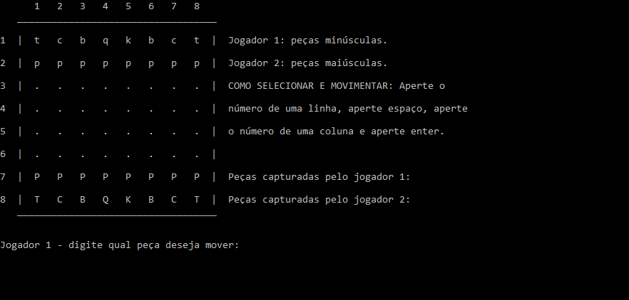

# **Tabuleiro de xadrez**​

## Sobre

Projeto simples desenvolvido em C durante uma atividade da faculdade. Ele imita um tabuleiro de xadrez e suas peças, sem seguir corretamente as regras do jogo. O seu intuito é mostrar a movimentação das peças no tabuleiro utilizando os conhecimentos obtidos durante as aulas. Nesse projeto você encontra:

- Estrutura condicional
- Laço de repetição
- Array unidimensional e bidimensional
- Funções e procedimentos

## Como utilizar

Primeiramente você deve compilar o arquivo *tabuleiro-xadrez.c* utilizando o compilador de sua preferência. Após aberto, temos as peças (letras minúsculas para o jogador 1 e maiúsculas para o jogador 2):

- **P** e **p** para peão
- **T** e **t** para torre
- **C** e **c** para cavalo
- **B** e **b** para bispo
- **K** e **k** para rei
- **Q** e **q** para rainha

O jogador deve escolher uma de suas peças para movimentar. Caso selecione a peça corretamente, o jogador deve movê-la, seja para um lugar vazio ou para capturar a peça do outro jogador. Para selecionar ou mover uma peça você deve:

1. Escolher o número de uma linha
2. Apertar espaço
3. Escolher o número de uma coluna
4. Apertar enter

Caso o jogador digite qualquer informação errada a peça não será selecionada ou movimentada. Todas as peças que os jogadores capturam são exibidas na tela. A aplicação chega ao fim quando o jogador captura o rei do outro jogador. 